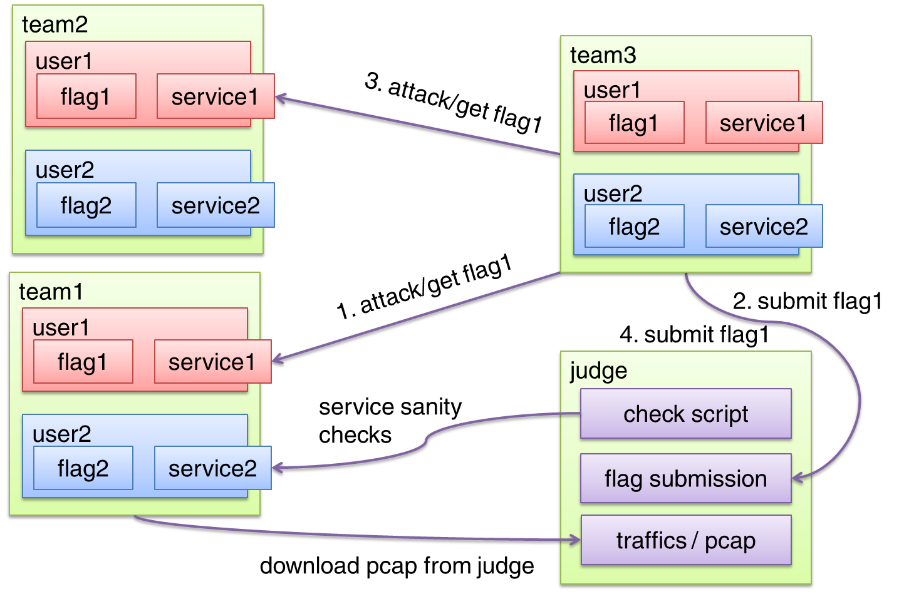
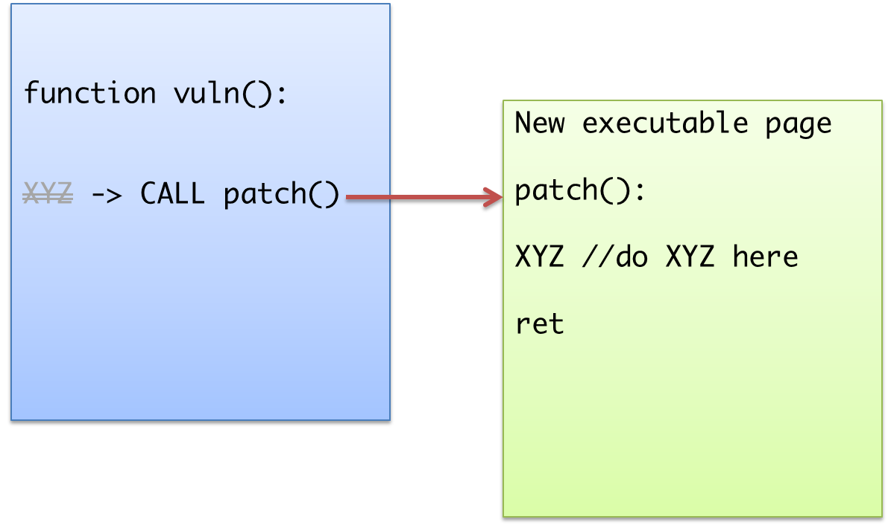
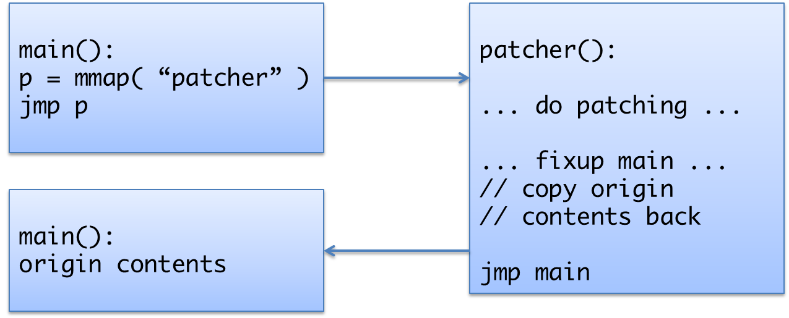
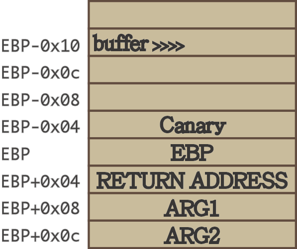

---
title: Defense in CTF
---

# Defense

## Defense
+ 阻截攻擊不論在實務上或在 CTF 裡都是重要的工作
+ 為了比賽的遊戲性及可看性，防禦的難度會比正常情況高

## Attack & Defense 規則
+ 每支隊伍負責管裡一模一樣的 server & services
    + Services 以特定的 port 對所有隊伍開放
+ 透過攻擊其它隊伍的服務，入侵對方主機
    + Judge 以是否能得到對方主機上的 flag 來判定是否入侵成功

##


## Defcon Attack & Defense Rules
+ 共 20 隊，每隊擁有相同的 ARM gamebox
+ 每個 service 以獨立的 user 運作，另外有一個 team user 可以任意 su 成 service user
    + 每個 flag 只有對應的 service user 有讀取權限
+ Service 故障跟 flag 被偷的失分相同，皆為 19 分
+ 每個 round 五分鐘，flag 會更新且取得的 flag 必須在該 round submit 才有效

## 防禦的困難點
+ 沒有 root，有不少工作沒辦法做
    + iptables
    + log / tcpdump
    + 權限的控管
+ 沒有 ptrace、seccomp 等制作 sandbox 用的 library
+ 沒有即時的流量監控


## 防禦工作及方式
+ 修補漏洞
    + Patch
    + Hook
+ 妨礙漏洞利用
    + Wrapper / filter
    + Misc.
+ 封包分析
    + 尋找攻擊封包

# Binary Patching

## Binary Patching
+ 在沒有 source 的情況下，直接修改 binary 修補漏洞
+ 平常可以應用在軟體的破解、修改上
+ 在逆向時也常常會需要 patching
    + 移除一些 anti-debuging 或修正 disassemble 的片段
    + 加入 tracing 或 logging function

## Static & Dynamic
+ 依照修改 binary 檔的時間，可以分為 static 和 dynamic
+ Static 直接修改原 binary，取代原本的指令
+ Dynamic 在程式啟動後先載入一段 code 去修改 binary 中的指令

## Example
+ `sprintf()` buffer overflow in [pepper](src/pepper) (ISG 2014)
    + Extend stack frame size
    + Reallocate buffer

## Example
+ Reverse [bin100](src/bin100) (ebCTF 2013)
    + My first CTF task
    + Replace `==` to `!=`

## Limitations
+ Static patching 受到 bytecode 長度的限制，沒有辦法加入比原本長的指令
+ 假如要插入的內容在 runtime 時才能確定則沒辦法 patch

## Dynamic Patching
+ [src](src.tar.gz)
+ 在 runtime 時動態加入或修改指令
    + `mprotect()` 解除記憶體寫入保謢
    + 插入或修改 binary code
    + 如果有必要，可以加掛新的 page 用來放更長的 code
    + `mprotect()` 打開寫入保謢
+ 只要修改 patcher 就可以加上新的 patch

## Dynamic Patching
+ 基本上可以加入任意大小的 patch


## Dynamic Patching
+ 載入 patch 可以利用 `LD_PRELOAD`
+ `__attribute__ ((constructor)) void init(void)`
    + 會在所有 segment 載入後才執行，但在 main 之前
+ 可以 allocate 需要額外的 function

## Example
+ Input out of range in [pepper](src/pepper) (ISG 2014)
    + 存在一個 information leaking 漏洞
    + 加入對輸入範圍的檢查

## Dynamic Patching
+ 沒有 binary code 長度限制的問題
+ 適合要加入某些新的功能時
+ 甚至可以輕易換掉整個 function
    + 只要在 function entry 插入 `jmp` 指令
+ 版本控制容易

## Limitations
+ 寫壞時 debug 比較困難
    + 比賽進行中更難
+ 可能不需要寫 assembly code，但要注意 gcc 編譯出來的 function 不會改到重要的 register
    + 可以內嵌 assembly 備份全部 register
    + 如果功能較簡單不如直接寫 assembly
+ 有 ASLR 時要注意改寫的 address
    
## Tricks
+ Hijack with trap
+ Without `LD_PRELOAD` (e.g. with `-static`)

## Hijack with trap
+ 空間太小連一個 function 都放不下，或不好處理
+ 可以插入 debugging trap (0xCC)，只要一個 byte
+ 註冊 signal handler on `SIGTRAP`
+ signal handler 還可以保證不會影響 register 的內容
+ 有多個 handler 時可以用 `eip` 的值來判斷是從哪裡跳過來

## Without LD_PRELOAD
+ `LD_PRELOAD` 沒有辦法使用或沒有作用，例如 static ELF
+ 改寫 `main()` 或 `_start`，加入一段 loader 
    + `mmap` + `jmp/call` 載入自己的 patcher
    + loader 載入完 patcher 後，可以還原 main() 原本的內容，最後再重新跳回 main()



# Wrapper

## Wrapper
+ 實際上沒有修補好漏洞，但包上 wrapper 後將使得 exploit 變得困難或不可能
+ 使用上較靈活，也不一定要修改到 binary 本身
+ 發現漏洞後，可以加上針對這個漏洞的 wrapper
+ 也有泛用型的 wrapper，針對常見的漏洞型態提供保護
    + 類似於 application firewall

## 用途
+ Input/output filter
+ Library harden
+ Sandbox

## Input filter
+ ASCII/number only 
    + Buffer overflow 要跳轉的 address 難以直接輸入
+ Forbidden keywords
    + e.g. 過濾 flag, cat, sh 等 keyword
+ 過濾 format string

## Output filter
+ 過濾 flag 內容
+ 過濾非 ASCII 字元
    + 避免 information leaking

## Filter 實作
+ 由於沒有 tcpdump 拿不到即時的封包，需加在 binary 上
+ Hook 掉 input / output function
    + 在 `read()`, `gets()`, `scanf()` 等 function 上過濾
+ 轉接 file descriptor / socket
    + 接走 remote 來的輸入，檢查後再送進 service
    + `remote <-> I/O filter <-> local service`

## Filter
+ 過濾字元是很有效的通用防禦，在沒有辦法輸入特定 address 的情況下要進行 control flow hijack 十分困難 
+ 因此 judge 方會通常針對這點進行檢查，這樣的 filter 很可能導致 service check fail

## Library Harden
+ 修改或換掉 library，使對方難以利用 ret2lib 進行攻擊
+ 也可以加強 library 本身的安全特性
    + 關閉 format string 的寫入
    + `malloc()` 隨機化


## Library Harden
+ 換掉 library
    + 使對方沒有辦法得到 `system()`, `exec()` 的 address
    + `LD_LIBRARY_PATH`, `LD_PRELOAD`
+ patch 掉不需要的 function
    + 將 `system()`, `exec()` 等 function 破壞掉
    + 還是有可能直接被 ROP 攻擊

## Sandbox
+ 使用 `ptrace` 攔截不合法 system call
+ 使用 `seccomp` 禁止不合法 system call
+ 有經驗的 attack & defense 比賽都會關閉這兩個功能
    + 或巧妙的設計 service 使得這些 system call 會被使用，而無法完全禁止

# Binary Harden

## Binary Harden
+ 加強 binary 本身，使漏洞難以利用，在還未找到漏洞時可以直接加上這類防禦
    + 開啟 DEP
    + GOT readonly
    + Stackguard randomize
    + Dynamic recompile

## 開啟 DEP 保謢

``` no-highlight
Usage: execstack [OPTION...]
execstack -- program to query or set executable stack flag

  -c, --clear-execstack      Clear executable stack flag bit
  -q, --query                Query executable stack flag bit
  -s, --set-execstack        Set executable stack flag bit
  -?, --help                 Give this help list
      --usage                Give a short usage message
  -V, --version              Print program version

```

## GOT 唯讀
+ Global offset table 用來查詢外部 library 中函式的位址
+ 因為是 load before call 所以是 table 可寫的，內容有可能被改寫導致 hijack
+ 可以使用 binary patching，改掉 `.plt` 上根據 GOT 內容 `jmp` 的寫法，直接寫死 function address

## Stackguard Randomize
+ `mov eax, large gs:14h` 取得的 canary 內容是固定的
    + 對 fork 式且沒有重新 exec 的 service 來說，可以被 stack reading 推出 canary
    + 若存在 information leaking 漏洞，就可以繞過 stackguard 的保護

##


## Stackguard Randomize
+ 改成 `call get_canary()` 這樣的型式，去拿新的隨機 canary
+ 檢查時的 `xor eax, large gs:14h` 也要一起修改
+ 這兩段 bytecode 是固定的很容易辨認，基本上做簡單的字串比對並取代不太會出問題，保險一點也可以再從 disassembler 檢查

## Stackguard Randomize
+ 多層 function call 時，要將上一層的 canary 存起來
+ 取得 canary 時，push 進 stack 保存起來
+ 檢查 canary 時，從 stack pop 出來檢查

## Dynamic Recompile
+ 利用類似 binary translation 的技術，以 basicblock 為單位重新建立 binary，並在這個過程中動態加強安全性
+ [Intel Pin - A Dynamic Binary Instrumentation Tool](https://software.intel.com/en-us/articles/pin-a-dynamic-binary-instrumentation-tool)
+ 也可以自己寫簡單的 translator

## Dynamic Recompile
+ 用途
    + Whole binary ASLR
    + Call/return sanity check
    + 取代 ptrace/seccomp

## Whole binary ASLR
+ 一般來說 code 本身的 ASLR 功能是關閉的 (without `-pie -fPIC`)，可以被 ROP 類的攻擊方法利用
+ DBI 可以將真正執行的 code，以 basicblock chaining 的方式重新排列到新的位置去，造成 ret2text 類的攻擊幾乎不可能

## Call/return sanity check
+ Function call 發生時，對 return address 做額外的保護
    + 備份到它處，避免 buffer overflow 時被改動
    + xor 一個值 (類似 stackguard)，攻擊者進行 buffer overflow 時沒有辦法知道要覆蓋怎樣的內容
+ Return 時進行檢查

## 取代 ptrace/seccomp
+ 可以直接取代掉 `int`, `syscall` 指令，對 syscall number 進行檢查
+ 完全阻止開出 shell 的可能

## Limitations
+ 效能問題，以 Intel Pin 來說大約下降 30%~40%
+ 防範 control flow hijack，但無法阻止邏輯上的漏洞或 information leaking
+ 因為過度有效，以 CTF 來說有可能直接被比賽規則禁用

# Misc

## Logging by Wrapper
+ 可以從直接從 wrapper 得到輸入輸出
    + 提早得到攻擊封包
+ Backtrace & function calls
    + 檢查有沒有異常的 function call 
    + 利用 footprint 和 backtrace 的資訊，很容易追踨並找出漏洞

## Drop connection
+ 以 xinetd 建立的 service 來說，可以從 `REMOTE_HOST` 這個環境變數得到對方的 IP
+ 如果 judge 的檢查機制不夠強，可以直接切掉強隊的連線

## 同步執行檢驗
+ 以 wrapper 將 input 同時送到兩個 process 上執行
+ Service 如果沒有隨機成份，理論上輸出要完全相同
    + 除了跟 ASLR 有關的部份!
    + 如果兩個 process 的 output 不匹配，很可能就是被攻擊了

## 反向 stack
+ 發現有 buffer overflow 時，如果只是加大 stack frame 還是有可能被攻擊
+ 反過來把 stack frame 開在 return address 之後

``` no-highlight
var1                 return addr
buf1           -->   ...
...                  var1
return addr          buf1
```

## 字串取代
+ 想使用 wrapper 過濾 keyword (e.g. flag) 但因為 judge 的 check script 會包含該 keyword，不可以直接 reject
+ 輸入時取代字串，輸出時再換回
    + `flag -> f14g`, `f14g -> flag`
    + 對方試圖讀取 flag 內容時會失敗，但 judge checking 又可以檢查到正確的輸出

## 流量重新導向
+ 導向至其它 server
    + 一般規定必需在本機上執行
+ 所有 service 導向至同一個 user

## Conclusions
+ Defense 其實是很容易的
    + 特別是在 CTF 中，時間有限而且還沒辦法得知對方做了哪些防護
    + 也因此良好的 attack & defense 題目很難出
+ 實務上 sandbox 和 DBI 一類的防護很有效
    + 但沒有辦法避免 information leaking
    + 多少會造成 performance 下降的問題


