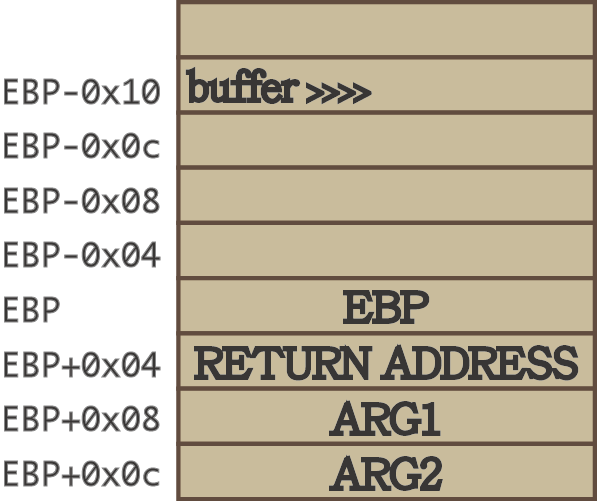

---
title: Exploit the Vulnerability
---

# Source Code

## Source Code

[Examples](src.tar.gz)

# Bug &#8594; Vulnerability

## Step 1: 尋找漏洞
+ 用力看 code (代碼審計，code audit)
+ Fuzz testing
    - Crash
    - 輸出不該有的內容

## Step 2: Control-flow Hijack
+ 試著控制程式的流程
    - 改掉返回地址
    - 改掉函式指標，使得呼叫函式時的行為改變
    - 改掉變數值，使得程行的行為改變 (e.g. uid = 0)

## Step 3: Execute Payload
+ 執行攻擊者的目標
    - 開出 shell
    - 撈資料
    - 植入後門 (backdoor)

# Buffer Overflow

## Vulnerable Function
+ `gets`
+ `scanf`
+ `strcpy`
+ `memcpy`
+ `sprintf`

## Stack Buffer Overflow
+ Stack 上的區域變數存在**溢出** (overflow) 漏洞
+ 可以覆蓋掉返回地址 (return address)
+ 又稱 stack smashing

## Example: gets()
``` cpp
#include <stdio.h>

void hacked() {
  puts("Hacked!!");
}

int main() {
  char str[10];
  gets(str);
}
```

## Compiled with gcc

``` no-highlight
gcc -o gets gets.c -m32 -fno-stack-protector -zexecstack
gets.c: In function ‘main’:
gets.c:9:3: warning: ‘gets’ is deprecated (declared at /usr/include/stdio.h:638) [-Wdeprecated-declarations]
   gets(str);
   ^
/tmp/cc4cukNn.o: In function `main':
gets.c:(.text+0x25): warning: the `gets' function is dangerous and should not be used.
```

## Return Hijack
+ 返回地址會在呼叫函式時，會被堆到 stack 上
+ 這個函式內的區域變數，會存放在比較低的位址
+ 如果這個變數是個陣列，寫入過多資料時就會覆蓋到在比較高位的返回地址

## Stack Buffer Overflow



## From Crash to Hack
+ 如果只是輸入的資料太多，程式通常就只會 crash
+ 必須構造特定的資料，才能利用這個漏洞
+ 需在輸入中放上要跳轉到的地址

## Tips
+ 先跳到已知的函式上，檢查有沒有成功控制程式流程
    - 有沒有如預期的輸出
    - 跳到輸入函式上，應該要停住等待輸入 (但如果再輸入一些內容通常又會 crash)

## Jump to Shellcode
+ 要想辦法找到 shellcode 的位址
+ 有 ASLR 的情況下，stack base 會隨機化，每次 shellcode 的位址會不同

## NOP slide
`\x90\x90\x90\x90\x90\x90\x90\x90\x90`<br>`\x90\x90\x90\x90\x90\x90\x90\x90\x90`<br>`\x90\x90\x90\x90\x90\x90\x90\x90\x90`

+ 記憶體中塞滿 `nop` 指令，最後面接上 shellcode
+ 跳到其中任何地方最後都會執行到 shellcode

## Jump to Shellcode
+ NOP slide 基本上不會成功，因為 ASLR 的範圍太大了
+ 利用暫存器或 stack 上殘留的值做精確的跳轉

## Gadget
+ KK <span style="font-family:'Sans-serif'">\[\`g&#230;d&#658;&#618;t\]</span> 
  小機件；（小巧的）器具；小玩意兒\[C\]
+ 一小段有用的 binary code
+ 即使不是原本就有指令，也有可能恰好構成有用的 gadget

## Call/Jump Reg
+ gcc 生成的執行檔中 `call eax` 很常見
+ 另外如果有 `jmp esp` 這樣的指令也可以利用，因為 stack 上的內容是可以被 overflow 控制的

## Return by Value on Stack
+ x86 的參數會用 stack 傳遞，可能有 buffer pointer
+ 區域變數的值也有可能留在 stack 上
+ 如果能將 esp 調整到正確的位置再 return，就可以利用

## Example: input

``` cpp
#include <stdio.h>
int input(int len, char *str) {
  char buf[80];
  while (len--) {
    buf[len] = str[len];
    if (buf[len]==' ') buf[len] = '_';
  }
  return 0;
}
int main() {
  char str[0x80];
  fgets(str, sizeof(str), stdin);
  input(strlen(str)-1, str);
}
```

# Shellcode

## 特性
+ 不可以有當做字串結尾的 `'\0'` 字元，或其它會被函數截斷的字元
+ Position independent，在位址不確定的情況下也要可以正常執行

## Null-free

+ 常見的緩衝區溢出是對字串操作時發生，這樣我們要送的  code 中就不可以有代表字串結束的`'\0'`
+ 例如 `strcpy` 複製字串到 stack buffer 上，如果其中有 `'\0'` 就不會產生溢出

## Position Independent Code

+ 沒有辦法確定 shellcode 被放在哪裡的情況，不可以指定絕對位址
+ 一般 `jmp` 和 `call` 都是用相對位址，但拿 .data 裡的內容時會是絕對位址

## Launch a shell

``` avrasm
section .text
global _start
_start:
    mov eax, 0x0b
    mov ebx, sh
    mov ecx, argv
    mov edx, envp
    int 0x80

section .data
argv:
    dd sh, 0
envp:
    dd 0
sh:
    db "/bin/sh", 0
```

## How to set eax to 0?
+ `mov eax, 0x0` &#8594; `b8 00 00 00 00`

## How to set eax to 1?
+ `mov eax, 0x0` &#8594; `b8 01 00 00 00`

## Get offset of the buffer (.data)?
+ `mov ebx, sh` &#8594; `bb a4 90 04 08`

## Embed a null-terminated string 
+ `sh: db "/bin/sh", 0`

## Build arrays or structures
+ `argv: dd sh, 0`
+ `envp: 0`

## General Solution
+ Read and jump
+ Escape
+ Push and jump

## Auto Escaping
``` avrasm
_start:
  jmp shellcode
escape:
  xor eax, eax
  mov esi, [esp]
  mov edi, esi
.L1:
  mov dl, [esi]
  inc esi
  cmp dl, 0xff  ; escape charater - 0xff
  je .B1
  mov [edi], dl
  inc edi
  jmp .L1
.B1:            ; escape
  mov dl, [esi]
  inc esi
  cmp dl, 0xff  ; 0xff 0xff - shellcode end
  jne .B2
  ret
.B2:            ; 0xff {others} - replace to '\0'
  mov [edi], al
  inc edi
  jmp .L1
shellcode:
  call escape
```

## Read and Jump
+ 如果 I/O 能繼續，就可以使用
+ 寫一段 null-free 的 `read(0, esp, length) + jmp esp` 就行

## Push and Jump
+ 另一種 escape 的做法，把 shellcode 用 `push` 全部放到 stack 上然後 `jmp esp`
+ Generator 比較麻煩

# Buffer Overflow Examples

## gets

``` cpp
int main() {
  char str[10];
  gets(str);
}
```

## scanf

``` cpp
int main() {
  char str[10];
  scanf("%s", str);
}
```

## strcpy

``` cpp
void foo(char *a) {
  char str[10];
  strcpy(str, a);
}
```

## sprintf

``` cpp
void foo(char *a) {
  char str[10];
  sprintf(str, "%s", a);
}
```

## memcpy

``` cpp
void foo(char *a, int n) {
  char str[10];
  memcpy(str, a, n);
}
```

## Failed fgets

``` cpp
void readline(char *buf, int size) {
  int i = 0;
  while (1) {
    buf[i] = getchar();
    if (buf[i]=='\n' || i==size) {
      buf[i] = 0;
      break;
    }
    i++;
  }
}
int main() {
  char buf[16];
  readline(buf, 16);
}
```

## Failed read

``` cpp
int foo() {
  char str[16];
  read(0, str, 16);
  puts(str);
}
```

## Failed read 2

``` cpp
int foo() {
  char str[16];
  int len;
  len = read(0, str, 16);
  str[len] = 0;
}
```

## stat + open file

``` cpp
int readfile(char *filename) {
  char buf[1024];
  struct stat st;
  FILE *f;
  int ch;
  char *p = buf;
  stat(filename, &st);
  if (st.st_size < 1024) {
    f = fopen(filename, "rb");
    while ((ch=fgetc(f))!=EOF) {
      *p++ = ch;
    }
  } else { /*File too large*/ }
}
```

# Protection & Bypass

## Prevent Buffer Overflow & Exploit

+ StackGuard
+ Data Execution Prevention

## gcc parameters
+ 關閉 StackGuard `-fno-stack-protector`
+ 關閉 DEP `-zexecstack` 

## StackGuard

+ 在函式被呼叫時，先在 stack 上放 **canary**
+ 函式返回前先檢查這個值有沒有被修改

## StackGuard


## Data Execution Prevention

+ Shellcode 不能執行，因為是 data (stack, .data)

## Service Using fork()

+ `fork()` 後 canary 的值不會改變
+ 任何 address 也會相同，即 ASLR 不會重新作用 

## Stack Reading

+ 每次多 overflow 一個 byte，測試可能的值
+ 如果沒有 crash 就表示猜對了
+ crash 就表示猜錯了，但重新連上 service 又會重新啟動

## ASLR 失效

+ 重新 fork 後 library 的位址不會改變
+ Leaking 和 exploit 可以分兩次連線進行

## Overwrite Local Variable

+ 如果只是 Overflow 到區域變數，不會蓋到 StackGuard canary
+ 利用程式本身對區域變數的操作，做出進一步的任意記憶體寫入

# Case Study

## string zip (with StackGuard)
``` cpp
#include <stdio.h>
char str[256];
int main() {
  int i, j;
  char buf[16];
  fgets(str, sizeof(str), stdin);
  for (i=0, j=0; str[i]; ++i) {
    if (str[i]!=' ') {
      buf[j++] = str[i];
    }
  }
  buf[j] = 0;
  puts(buf);
}
```
