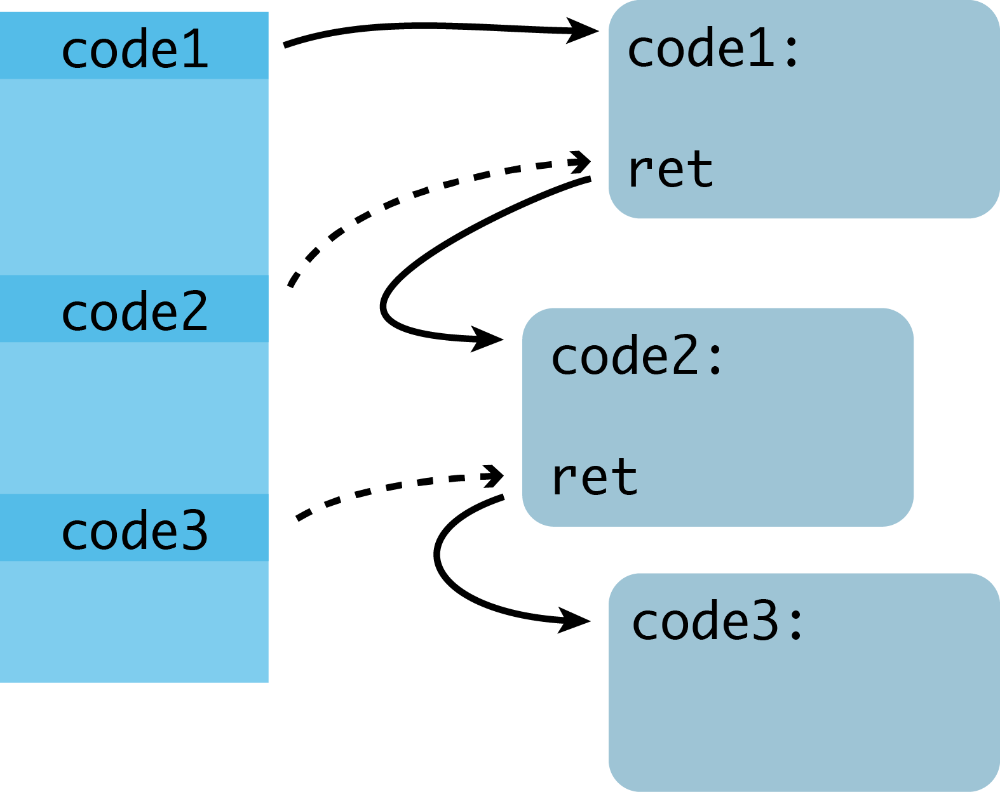

---
title: Return Oriented Programming
---

# Source code

##
[Source code](w4.tar.gz)

# Return to Code

## 繞過 DEP 保謢
+ 有 Data Execution Prevention 的情況下，即使能跳到 shellcode 上也沒有辦法執行
+ 不使用 shellcode，要直接利用原本程式的 code

## ret2text
+ 在 ASLR 沒有完全開啟 (gcc 預設值) 的情況下，text 段的位址是固定的，即常見的 `0x0804XXXX`
+ 因此，利用程式本身 text 的內容是很容易的
+ 然而，這些 code 不一定能執行想要的功能

## ret2lib
+ 一般情況下必定會有的 `libc.so.6`
+ 函式庫預設有 ASLR 保護，在洩漏基底位址前無法利用
+ 需要先利用 ret2text 洩漏基底位址，來計算每個函式的正確位址
+ 前提是有每個函式在函式庫裡的正確偏移量，通常是要拿到函式庫 .so 檔


## 實際上的問題
+ 過去沒有 DEP 時，我們只需要 return 一次，控制程式跳到 shellcode 上
+ 但 ret2text 後，會失去對程式的控制，就算能夠洩漏函式庫位址也無法再跳轉
+ 即使改用 `printf` 等格式化漏洞洩漏出函式庫基底，也不保證能找到正確的函式

## Return Oriented Programming
+ ret2text 或 ret2lib 後，我們希望可以繼續保有對程式流程的控制
+ **ret 後還可以再 ret**

## 中心思想
+ ret 後還可以再 ret 還可以再 ret 再 ret 後再 ret
+ 只要在堆疊上排列好每次 ret 的目標，就可以串連這些程式片段

##


## ROP Gadget
+ KK <span style="font-family:'Sans-serif'">\[\`g&#230;d&#658;&#618;t\]</span> 小機件；（小巧的）器具；小玩意兒\[C\]
+ 這些用來串連的 code 越短越好，最好只留下需要的功能

## 斷章取義
+ Gadget 一般來說包含 `ret` 前的數個指令，不需要從整個函式起點開始
+ 通常是 pop 數個暫存器後就 ret，這樣只要在堆疊上依序放好就可以控制暫存器的值


## Gadget Finder
+ [ROPgadget](https://github.com/JonathanSalwan/ROPgadget)
+ `pip install ropgadget`
+ 找出特定的 ROP gadget

``` no-highlight
0x0804860c : pop ebx ; pop esi ; pop edi ; pop ebp ; ret
0x080483a1 : pop ebx ; ret
0x0804860e : pop edi ; pop ebp ; ret
0x0804860d : pop esi ; pop edi ; pop ebp ; ret
```

## 使用 ROP 進行 syscall
+ 需要控制暫存器 `eax`, `ebx`, `ecx`, `edx`
+ 需要 `int 0x80`

# Case Study

## rop.c

``` cpp
#include <stdio.h>
#include <stdlib.h>
char buf[1024];

int loop() {
  char str[100];
  if(!gets(str)) return 0;
  snprintf(buf, sizeof(buf), str);
  write(1, buf, strlen(buf));
  return 1;
}

void main() {
  while(loop());
  exit(0);
}
```

## Exploit 流程
+ 洩漏函式庫內部位址 (由 snprintf 的 GOT entry)
+ 洩漏 StackGuard canary
+ ret2text，尋找函式庫內的 ROP gadget (利用 write@plt)
+ 使用 ROP 呼叫 execve()，開出 shell

## Trace
[Trace-view](https://csie.ctf.tw/slides/w5/log-dump/index.html)

